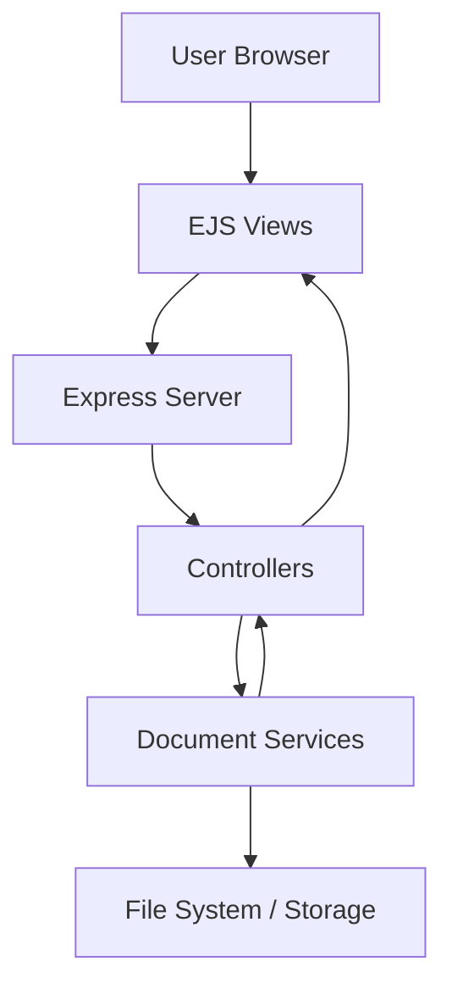

# 📁 Document Manager – All-in-One PDF & Document Utility

A powerful, web-based **Document Management System** built using **Node.js, Express, and EJS**, designed to simplify everyday document operations such as **PDF merging, conversion, rotation, deletion, and file management** through a clean and intuitive interface.

This project focuses on **server-side processing, modular architecture, and real-world usability**, making it suitable for both academic and production-grade applications.

---

## 🚀 Features

✔ Upload and manage documents securely  
✔ Merge multiple PDF files into one  
✔ Convert **Word ↔ PDF** seamlessly  
✔ Rotate PDF pages dynamically  
✔ Delete selected documents safely  
✔ Clean UI with EJS templating  
✔ Scalable backend architecture  
✔ Ready for cloud deployment (Vercel)

---

## 🧠 System Architecture



---

## 🛠 Tech Stack

| Layer        | Technology |
|-------------|------------|
| Frontend    | EJS, HTML, CSS |
| Backend     | Node.js, Express.js |
| Templating  | EJS |
| File Ops    | PDF Libraries, FS |
| Deployment  | Vercel |
| Versioning  | Git |

---

## 📂 Project Structure

```
DOCUMENT_MANAGER/
│
├── controllers/
├── services/
├── views/
│   ├── includes/
│   ├── home.ejs
│   ├── merge.ejs
│   ├── rotate.ejs
│   ├── pdf-to-word.ejs
│   ├── word-to-pdf.ejs
│   └── delete.ejs
│
├── public/
├── uploads/
├── app.js
├── package.json
├── vercel.json
└── README.md
```

---

## ⚙️ Installation & Setup

```bash
git clone https://github.com/your-username/document-manager.git
cd document-manager
npm install
npm start
```

Server runs at: http://localhost:3000

---

## ☁️ Deployment

```bash
vercel deploy
```

---

## 📈 Future Enhancements

🚀 Drag-and-drop uploads  
🚀 User authentication  
🚀 Cloud storage integration  
🚀 OCR support  

---

## 👨‍💻 Author

**Venkata Harish Balaji**  
📧 venkataharish59@gmail.com  
🔗 https://github.com/Har1shz1
