# 📁 Document Manager – All-in-One PDF & Document Utility

A powerful, web-based **Document Management System** built using **Node.js, Express, and EJS**, designed to simplify everyday document operations such as **PDF merging, conversion, rotation, deletion, and file management** through a clean and intuitive interface.

This project focuses on **server-side processing, modular architecture, and real-world usability**, making it suitable for both academic and production-grade applications.

---

## 🚀 Features

✔ **Upload and manage documents** securely  
✔ **Merge multiple PDF files** into one  
✔ **Convert Word ↔ PDF** seamlessly  
✔ **Rotate PDF pages** dynamically  
✔ **Delete selected documents** safely  
✔ **Clean UI** with EJS templating  
✔ **Scalable backend architecture**  
✔ **Ready for cloud deployment** (Vercel, Render, Railway)

---

## 🧠 System Architecture

```mermaid
flowchart TD
    User[🌐 User Browser] -->|HTTP Request| Server[🖥️ Express Server]
    Server --> Router[🛣️ Express Router]

    Router --> HomeCtrl[🏠 Home Controller]
    Router --> UploadCtrl[📤 Upload Controller]
    Router --> MergeCtrl[🔄 Merge Controller]
    Router --> ConvertCtrl[🔄 Convert Controller]
    Router --> RotateCtrl[↻ Rotate Controller]
    Router --> DeleteCtrl[🗑️ Delete Controller]

    HomeCtrl --> HomeView[📄 home.ejs]
    UploadCtrl --> UploadService[📊 Upload Service]
    MergeCtrl --> MergeService[🔗 Merge Service]
    ConvertCtrl --> ConvertService[🔀 Convert Service]
    RotateCtrl --> RotateService[↔️ Rotate Service]
    DeleteCtrl --> DeleteService[🧹 Delete Service]

    UploadService -->|Save| FileSys[📁 File System]
    MergeService -->|Process| FileSys
    ConvertService -->|Convert| FileSys
    RotateService -->|Modify| FileSys
    DeleteService -->|Remove| FileSys

    FileSys -->|Return| Response[📨 Response]
    Response -->|HTML/File| User
```



---

## 🛠 Tech Stack

| Layer | Technology |
|------|-----------|
| Frontend | EJS, HTML5, CSS3, JavaScript |
| Backend | Node.js, Express.js |
| PDF Processing | pdf-lib, pdf-parse |
| Document Conversion | libreoffice, unoconv |
| File Management | multer, fs-extra |
| Templating | EJS |
| Styling | Bootstrap 5, Custom CSS |
| Deployment | Vercel, Render, Railway |
| Version Control | Git, GitHub |

---

## 📂 Project Structure

```
DOCUMENT_MANAGER/
│
├── controllers/
├── services/
├── views/
├── public/
├── uploads/
├── processed/
├── app.js
├── routes.js
├── vercel.json
├── package.json
└── README.md
```

---

## ⚙️ Installation & Setup

```bash
git clone https://github.com/your-username/document-manager.git
cd document-manager
npm install
npm start
```

📍 Server runs at: http://localhost:3000

---

## ☁️ Deployment

```bash
vercel deploy
```

---

## 📈 Future Enhancements

🚀 Drag-and-drop uploads  
🚀 User authentication  
🚀 Cloud storage (AWS S3)  
🚀 OCR for scanned PDFs  

---

## 👨‍💻 Author

**Venkata Harish Balaji**  
📧 venkataharish59@gmail.com  
🔗 https://github.com/Har1shz1
