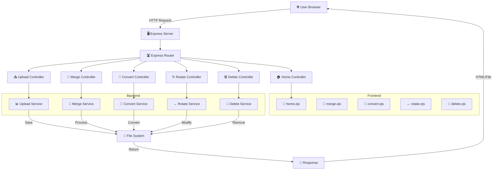
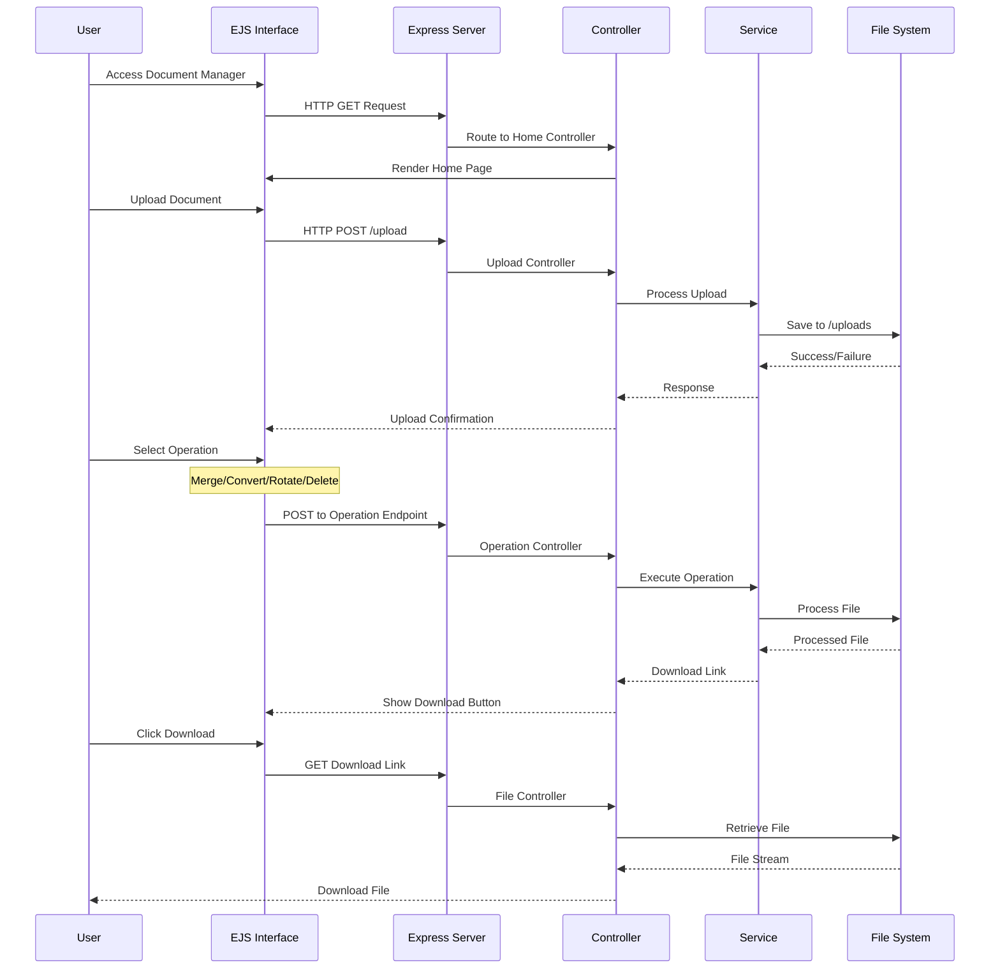

# 📁 Document Manager – All-in-One PDF & Document Utility

A powerful, web-based **Document Management System** built using **Node.js, Express, and EJS**, designed to simplify everyday document operations such as **PDF merging, conversion, rotation, deletion, and file management** through a clean and intuitive interface.

This project focuses on **server-side processing, modular architecture, and real-world usability**, making it suitable for both academic and production-grade applications.

---

## 🚀 Features

✔ **Upload and manage documents** securely  
✔ **Merge multiple PDF files** into one  
✔ **Convert Word ↔ PDF** seamlessly  
✔ **Rotate PDF pages** dynamically  
✔ **Delete selected documents** safely  
✔ **Clean UI** with EJS templating  
✔ **Scalable backend architecture**  
✔ **Ready for cloud deployment** (Vercel, Render, Railway)

---

## 🧠 System Architecture



📊 Application Workflow



---

## 🛠 Tech Stack

| Layer | Technology |
|------|------------|
| Frontend | EJS, HTML5, CSS3, JavaScript |
| Backend | Node.js, Express.js |
| PDF Processing | pdf-lib, pdf-parse |
| Document Conversion | libreoffice, unoconv |
| File Management | multer, fs-extra |
| Templating | EJS |
| Styling | Bootstrap 5, Custom CSS |
| Deployment | Vercel, Render, Railway |
| Version Control | Git, GitHub |

---

## 📂 Project Structure

```text
DOCUMENT_MANAGER/
DOCUMENT_MANAGER/
│
├── .env.example.txt          
├── .gitignore.txt            
├── README.md                 
├── package.json              
├── vercel.json              
├── app.js                   
│
├── controllers/              
│   ├── homeController.js
│   ├── uploadController.js
│   ├── mergeController.js
│   ├── convertController.js
│   ├── rotateController.js
│   └── deleteController.js
│
├── routes/                   
│   ├── merge.js
│   ├── rotate.js
│   ├── delete.js
│   ├── pdf-to-word.js
│   ├── pdf-to-jpg.js
│   ├── pdf-to-png.js
│   ├── pdf-to-json.js
│   ├── pdf-to-txt.js
│   ├── pdf-to-ppt.js
│   ├── pdf-to-tiff.js
│   ├── pdftoexcel.js
│   ├── pdftopng.js
│   ├── split.js
│   ├── watermark.js
│   └── editor.js
│
├── views/                    
│   ├── home.ejs
│   ├── index.ejs
│   ├── alltools.ejs
│   ├── services.ejs
│   ├── merge.ejs
│   ├── rotate.ejs
│   ├── delete.ejs
│   ├── howto.ejs
│   ├── pdf-to-word.ejs
│   ├── word-to-pdf.ejs
│   ├── nav.ejs
│   ├── footer.ejs
│   └── head.ejs.txt
│
├── public/                   
│   ├── css/
│   │   ├── style.css
│   │   ├── nav-style.css
│   │   ├── merger.css
│   │   ├── pdfeditor.css
│   │   ├── pdf-to-image.css
│   │   └── pdf-to-png.css
│   │
│   ├── js/
│   │   ├── arrow.js
│   │   ├── pageno.js
│   │   └── pdfannotate.js
│   │
│   └── images/
│       ├── pdf.png
│       ├── a.jpg
│       ├── addpages.png
│       ├── editpdf.png
│       ├── esign.png
│       ├── delete.svg
│       ├── pdf-to-excel.svg
│       ├── pdf-to-html.png
│       ├── favicon.ico
│       └── favicon.png
│
├── uploads/                  
│
└── utils/                    
    ├── word-to-pdf.js
    ├── pdf-to-excel.js
    └── pdf-to-image.js

```

---

## ⚙️ Installation & Setup

### 1️⃣ Clone the Repository
```bash
git clone https://github.com/your-username/document-manager.git
cd document-manager
```

### 2️⃣ Install Dependencies
```bash
npm install
```

### 3️⃣ Configure Environment
```bash
cp .env.example .env
```

Edit `.env`:
```env
PORT=3000
NODE_ENV=development
UPLOAD_PATH=./uploads
MAX_FILE_SIZE=10485760
```

### 4️⃣ Run the Application

Development:
```bash
npm run dev
```

Production:
```bash
npm start
```

📍 Server runs at: http://localhost:3000

---

## ☁️ Deployment (Vercel)

```bash
npm i -g vercel
vercel deploy
```

Production `.env`:
```env
PORT=3000
NODE_ENV=production
UPLOAD_PATH=/tmp/uploads
MAX_FILE_SIZE=52428800
```

---

## 🔐 Security Features

✅ File type and size validation  
✅ Path traversal protection  
✅ Secure file deletion  
✅ Rate limiting  
✅ Input sanitization  
✅ Automated temp file cleanup  

---

## 🧪 Testing

```bash
npm test
```

Covers:
- File upload validation  
- PDF merge  
- Document conversion  
- Page rotation  
- File deletion  
- Error handling  

---

## 📈 Future Enhancements

| Feature | Status |
|-------|--------|
| Drag-and-drop uploads | In Progress |
| User authentication | Planned |
| Cloud storage (AWS S3) | Planned |
| Batch processing | Proposed |
| OCR for scanned PDFs | Proposed |
| Activity logs & analytics | Proposed |
| Public API | Planned |

---

## 📄 License

MIT License – see `LICENSE` file.

---

## 🌟 Acknowledgments

- Express.js     
- pdf-lib  
- Bootstrap  
- Vercel  
