# 📁 Document Manager – All-in-One PDF & Document Utility

A powerful, web-based **Document Management System** built using **Node.js, Express, and EJS**, designed to simplify everyday document operations such as **PDF merging, conversion, rotation, deletion, and file management** through a clean and intuitive interface.

This project focuses on **server-side processing, modular architecture, and real-world usability**, making it suitable for both academic and production-grade applications.

---

## 🚀 Features

✔ **Upload and manage documents** securely  
✔ **Merge multiple PDF files** into one  
✔ **Convert Word ↔ PDF** seamlessly  
✔ **Rotate PDF pages** dynamically  
✔ **Delete selected documents** safely  
✔ **Clean UI** with EJS templating  
✔ **Scalable backend architecture**  
✔ **Ready for cloud deployment** (Vercel, Render, Railway)

---

## 🧠 System Architecture

```mermaid
flowchart TD
    User[🌐 User Browser] -->|HTTP Request| Server[🖥️ Express Server]
    Server --> Router[🛣️ Express Router]

    Router --> HomeCtrl[🏠 Home Controller]
    Router --> UploadCtrl[📤 Upload Controller]
    Router --> MergeCtrl[🔄 Merge Controller]
    Router --> ConvertCtrl[🔄 Convert Controller]
    Router --> RotateCtrl[↻ Rotate Controller]
    Router --> DeleteCtrl[🗑️ Delete Controller]

    HomeCtrl --> HomeView[📄 home.ejs]
    UploadCtrl --> UploadService[📊 Upload Service]
    MergeCtrl --> MergeService[🔗 Merge Service]
    ConvertCtrl --> ConvertService[🔀 Convert Service]
    RotateCtrl --> RotateService[↔️ Rotate Service]
    DeleteCtrl --> DeleteService[🧹 Delete Service]

    UploadService -->|Save| FileSys[📁 File System]
    MergeService -->|Process| FileSys
    ConvertService -->|Convert| FileSys
    RotateService -->|Modify| FileSys
    DeleteService -->|Remove| FileSys

    FileSys -->|Return| Response[📨 Response]
    Response -->|HTML/File| User

    subgraph Frontend
        HomeView
        MergeView[🔄 merge.ejs]
        ConvertView[🔀 convert.ejs]
        RotateView[↔️ rotate.ejs]
        DeleteView[🧹 delete.ejs]
    end

    subgraph Backend
        UploadService
        MergeService
        ConvertService
        RotateService
        DeleteService
    end
```



📊 Application Workflow


---

## 🛠 Tech Stack

| Layer | Technology |
|------|------------|
| Frontend | EJS, HTML5, CSS3, JavaScript |
| Backend | Node.js, Express.js |
| PDF Processing | pdf-lib, pdf-parse |
| Document Conversion | libreoffice, unoconv |
| File Management | multer, fs-extra |
| Templating | EJS |
| Styling | Bootstrap 5, Custom CSS |
| Deployment | Vercel, Render, Railway |
| Version Control | Git, GitHub |

---

## 📂 Project Structure

```text
DOCUMENT_MANAGER/
│
├── controllers/
│   ├── homeController.js
│   ├── uploadController.js
│   ├── mergeController.js
│   ├── convertController.js
│   ├── rotateController.js
│   └── deleteController.js
│
├── services/
│   ├── uploadService.js
│   ├── mergeService.js
│   ├── convertService.js
│   ├── rotateService.js
│   └── deleteService.js
│
├── views/
│   ├── includes/
│   │   ├── navbar.ejs
│   │   ├── footer.ejs
│   │   └── head.ejs
│   │
│   ├── home.ejs
│   ├── upload.ejs
│   ├── merge.ejs
│   ├── convert.ejs
│   ├── rotate.ejs
│   └── delete.ejs
│
├── public/
│   ├── css/
│   │   └── style.css
│   ├── js/
│   │   └── main.js
│   └── images/
│       └── logo.png
│
├── uploads/
├── processed/
│
├── app.js
├── routes.js
├── vercel.json
├── package.json
├── .env.example
├── .gitignore
└── README.md
```

---

## ⚙️ Installation & Setup

### 1️⃣ Clone the Repository
```bash
git clone https://github.com/your-username/document-manager.git
cd document-manager
```

### 2️⃣ Install Dependencies
```bash
npm install
```

### 3️⃣ Configure Environment
```bash
cp .env.example .env
```

Edit `.env`:
```env
PORT=3000
NODE_ENV=development
UPLOAD_PATH=./uploads
MAX_FILE_SIZE=10485760
```

### 4️⃣ Run the Application

Development:
```bash
npm run dev
```

Production:
```bash
npm start
```

📍 Server runs at: http://localhost:3000

---

## ☁️ Deployment (Vercel)

```bash
npm i -g vercel
vercel deploy
```

Production `.env`:
```env
PORT=3000
NODE_ENV=production
UPLOAD_PATH=/tmp/uploads
MAX_FILE_SIZE=52428800
```

---

## 🔐 Security Features

✅ File type and size validation  
✅ Path traversal protection  
✅ Secure file deletion  
✅ Rate limiting  
✅ Input sanitization  
✅ Automated temp file cleanup  

---

## 🧪 Testing

```bash
npm test
```

Covers:
- File upload validation  
- PDF merge  
- Document conversion  
- Page rotation  
- File deletion  
- Error handling  

---

## 📈 Future Enhancements

| Feature | Status |
|-------|--------|
| Drag-and-drop uploads | In Progress |
| User authentication | Planned |
| Cloud storage (AWS S3) | Planned |
| Batch processing | Proposed |
| OCR for scanned PDFs | Proposed |
| Activity logs & analytics | Proposed |
| Public API | Planned |

---

## 📄 License

MIT License – see `LICENSE` file.

---

## 🌟 Acknowledgments

- Express.js     
- pdf-lib  
- Bootstrap  
- Vercel  
